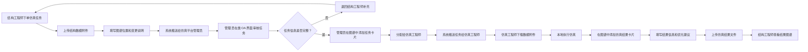
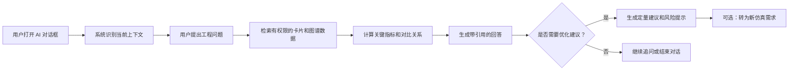

# 仿真数据管理平台需求规格说明书

版本：V0.3  
日期：2026-07-03  
适用阶段：展示原型细化、MVP 需求评审

## 1. 项目概述

### 1.1 背景

折叠方向盘产品开发过程中，结构方案会频繁迭代。每次结构变更后，结构工程师需要将新的三维数模传递给仿真工程师，仿真工程师完成模态、刚度等分析后，再将仿真结果、结论和相关文件反馈给结构工程师。

当前希望建设一个仿真数据管理平台，用于管理结构方案、仿真任务、仿真结果卡片、结果附件和方案之间的演化关系。平台不负责仿真求解，不替代 Abaqus、HyperMesh、ANSA 等仿真工具，只负责流程协作和数据沉淀。

### 1.2 建设目标

- 让结构工程师可以上传待仿真的数模并发起仿真需求。
- 让仿真平台管理员可以接收需求并分配给具体仿真工程师。
- 让仿真工程师可以用统一的结果卡片记录每次仿真结果，并上传关联文件。
- 让工程团队可以通过拖拽卡片形成仿真结果图谱，展示不同结构方案之间的继承、分叉、对比和演化关系。
- 让仿真平台管理员可以配置不同类型仿真结果卡片的字段、值类型和单位。
- 让历史仿真结果可检索、可追溯、可复用。
- 让用户可以通过平台内置 AI 对话框查询历史仿真结果，并基于已有卡片数据获得可追溯的定量优化建议。

### 1.3 非目标

- 不做仿真求解。
- 不直接解析大型求解结果文件中的全部场数据。
- 第一阶段不做复杂三维模型在线预览。
- 第一阶段不做复杂审批流、企业级权限矩阵和多组织隔离。
- AI 不直接执行仿真求解，不替代工程师判断；AI 建议必须基于平台已有卡片、变更说明、指标数据和可引用的历史结果。

## 2. 用户角色

### 2.1 仿真平台管理员

仿真平台管理员负责平台基础配置、仿真任务分配和团队协作管理。该角色合并原“管理员”和“仿真组长”的职责。

主要职责：

- 配置仿真结果卡片模板。
- 配置卡片字段名称、字段值类型、单位、是否必填、显示顺序。
- 配置分析类型，如模态分析、刚度分析、强度分析、疲劳分析。
- 配置项目、成员、角色和基础权限。
- 配置文件类型白名单、上传大小限制、归档规则。
- 配置 AI 可访问的数据范围、可回答问题类型、敏感文件访问策略和提示词模板。
- 查看结构工程师提交的仿真需求。
- 判断需求信息是否完整。
- 指派具体仿真工程师。
- 调整任务优先级和计划完成时间。
- 查看组内任务负载、完成情况和逾期风险。

### 2.2 结构工程师

结构工程师负责上传待仿真的结构方案和数模文件。

主要职责：

- 创建结构方案或结构版本。
- 上传数模文件，如 STEP、CATPart、CATProduct、Parasolid、装配包等。
- 填写结构变更说明、设计目的、关注问题和仿真需求。
- 查看任务状态、仿真结果卡片和图谱。
- 对结果提出修改意见或发起下一轮结构迭代。
- 通过 AI 对话查询当前性能较好的结构方案、不同方案的指标差异和可能的结构优化方向。

### 2.3 仿真工程师

仿真工程师负责执行仿真并沉淀结果数据。

主要职责：

- 接收分配给自己的仿真任务。
- 下载结构工程师上传的数模和需求说明。
- 在线创建或填写仿真结果卡片。
- 在卡片中填写关键结果字段，如一阶模态、二阶模态、质量、约束条件、结论等。
- 在卡片附件中上传仿真相关文件，如 odb、inp、data、cae、rpt、xlsx、png、mp4、pdf。
- 将卡片通过拖拽方式接入结果图谱，与其他卡片建立关系。
- 补充分析结论、风险说明和建议。
- 通过 AI 对话快速检索相似历史卡片、总结优化经验，并辅助生成定量优化建议。

## 3. 核心业务对象

### 3.1 项目

项目是平台的数据组织单元。

示例：折叠方向盘开发项目。

建议字段：

- 项目编号
- 项目名称
- 产品类型
- 项目阶段
- 项目负责人
- 创建时间
- 项目状态
- 项目说明

### 3.2 结构方案

结构方案表示一次结构设计版本或结构变更方案。

建议字段：

- 方案编号
- 方案名称
- 所属项目
- 父级结构方案
- 上传人
- 上传时间
- 结构变更说明
- 设计目标
- 数模文件
- 方案状态

结构方案可以形成树状关系，例如：

```text
V1 基准结构
├── A 加强筋加厚
│   ├── A1 加强筋位置外移
│   └── A2 局部开孔减重
└── C 锁止结构加强
    └── C2 锁止加强 + 轻量化
```

### 3.3 仿真任务

仿真任务是结构工程师与仿真团队之间的协作单元。

建议字段：

- 任务编号
- 所属项目
- 关联结构方案
- 关联图谱位置
- 图谱父节点或来源节点
- 分析类型
- 需求描述
- 结构变更说明
- 关注指标
- 数模附件
- 期望完成时间
- 需求发起人
- 仿真平台管理员
- 指派仿真工程师
- 任务优先级
- 任务状态
- 创建时间
- 接收时间
- 完成时间

任务状态建议：

```text
草稿
已提交
待管理员处理
待分配
已分配
仿真中
待补充信息
结果已提交
结构工程师已确认
需重新仿真
已归档
已取消
```

任务下单示例：

```text
结构工程师下单一条模态分析任务。
任务附件：结构数模文件。
图谱位置：挂接在 V1 基准结构或某个已有仿真结果卡片之后。
变更说明：为解决模态较低问题，在滑轨处增加了紧固件，并对侧边结构进行了掏空起筋以减重。
```

说明：结构工程师提交的仿真任务应在图谱中形成一个“待处理任务节点”或“待仿真结构节点”，仿真平台管理员审核后将其正式加入结果图谱并分配给仿真工程师。

### 3.4 卡片模板

卡片模板由仿真平台管理员配置，用于定义某类仿真结果卡片需要填写哪些字段。

示例：模态分析卡片模板。

建议字段：

- 模板编号
- 模板名称
- 分析类型
- 模板版本
- 是否启用
- 适用项目范围
- 创建人
- 更新时间

模板字段配置建议：

| 字段 | 说明 |
|---|---|
| 字段名称 | 如一阶模态、二阶模态、质量 |
| 字段编码 | 系统内部唯一编码 |
| 值类型 | 文本、数字、枚举、日期、布尔、文件引用、长文本 |
| 单位 | Hz、kg、mm、MPa、N/mm |
| 是否必填 | 是 / 否 |
| 默认值 | 可选 |
| 显示顺序 | 用于控制卡片展示 |
| 展示位置 | 节点摘要、详情页、对比表 |
| 校验规则 | 数值范围、小数位数、枚举选项 |

### 3.5 仿真结果卡片

仿真结果卡片是平台中管理仿真结果的核心对象。每一次仿真结果对应一个卡片。

建议字段：

- 卡片编号
- 卡片名称
- 所属项目
- 关联结构方案
- 关联仿真任务
- 使用模板
- 分析类型
- 填写人
- 填写时间
- 卡片状态
- 卡片归属仿真工程师
- 结果字段值
- 结论
- 风险说明
- 建议
- 附件列表
- 图谱位置

卡片维护规则：

- 每个仿真结果卡片归属于一个具体仿真工程师。
- 仿真工程师只能维护自己负责的仿真任务和自己创建的结果卡片。
- 仿真工程师可以查看其他仿真工程师的卡片，但不允许修改。
- 仿真平台管理员可以维护所有仿真卡片。

卡片状态建议：

```text
草稿
待复核
已发布
需修订
已归档
已废弃
```

### 3.6 卡片附件

卡片附件用于沉淀仿真相关文件。

附件类型示例：

- 求解输入文件：inp
- 求解结果文件：odb
- 数据文件：data、dat、rpt、csv、xlsx
- 前后处理文件：cae、hm、fem
- 报告文件：pdf、docx、pptx
- 图片和动画：png、jpg、gif、mp4
- 压缩包：zip、7z

建议字段：

- 附件编号
- 所属卡片
- 文件名
- 文件类型
- 文件大小
- 文件用途
- 上传人
- 上传时间
- 文件版本
- 存储路径
- 校验摘要

### 3.7 结果图谱

结果图谱由仿真结果卡片和卡片关系组成，用于表达方案演化、仿真继承、横向对比和决策路径。

图谱节点：

- 一个节点对应一个仿真结果卡片。
- 节点摘要展示关键字段，例如一阶模态、质量、结论状态。
- 节点颜色表达状态，例如推荐、淘汰、仿真中、已归档。

图谱边：

- 表示两个卡片之间的关系。
- 支持拖拽卡片建立关系。
- 支持修改或删除关系。

关系类型建议：

```text
来源于
结构迭代
参数调整
材料替换
减重优化
横向对比
复核结果
淘汰原因
推荐路径
```

### 3.8 AI 对话

AI 对话是平台内置的工程辅助问答入口。用户可以围绕项目、结构方案、仿真结果卡片和结果图谱提问，AI 基于平台内已有结构化数据和可检索文本进行回答。

典型问题示例：

```text
当前有哪些性能比较好的方案？
C2 方案相比 V1 基准结构，一阶模态提升了多少？
哪些结构变更对一阶模态提升最明显？
在质量增加不超过 3% 的前提下，历史上哪些优化方式效果最好？
基于以往仿真结果，下一轮结构优化建议优先调整哪里？
请列出所有一阶模态超过 45 Hz 且质量小于 1.85 kg 的方案。
```

AI 回答的数据来源建议包括：

- 仿真结果卡片字段值。
- 卡片变更说明。
- 卡片结论、风险说明和工程建议。
- 结构方案父子关系。
- 图谱节点和边关系。
- 附件元数据。
- 后续可选：仿真报告中的文本摘要。

AI 回答要求：

- 回答中应列出引用的卡片或方案编号。
- 对定量建议应给出计算依据，例如提升百分比、质量变化、指标排名。
- 对无法从现有数据支撑的内容应明确说明“不足以判断”。
- 不允许把 AI 推测包装成已验证仿真结论。
- 对优化建议应标注建议性质，例如“基于历史相关性推断，仍需仿真验证”。

### 3.9 AI 优化建议

AI 优化建议是 AI 对话中的一种结构化输出，用于辅助工程师形成下一轮结构优化思路。

建议内容可以包括：

- 推荐参考的历史方案。
- 相关结构变更说明。
- 对关键指标的定量影响。
- 建议优化方向。
- 预期收益区间。
- 风险或约束。
- 需要补充验证的仿真任务。

示例：

```text
建议优先参考 C2 方案的“锁止加强 + 轻量化”路径。
历史数据中，C2 相对 V1 一阶模态从 36.4 Hz 提升到 47.8 Hz，提升约 31.3%，质量从 1.75 kg 增加到 1.81 kg，增加约 3.4%。
如果下一轮目标是保持质量小于 1.85 kg，建议优先在锁止连接区域加强，同时对非关键轮辐背面做局部减薄。
该建议来自 C、C2、A1 三个已完成卡片的历史结果，仍需新一轮仿真验证。
```

## 4. 功能需求

### 4.1 仿真平台管理员功能

#### 4.1.1 卡片模板管理

仿真平台管理员可以创建、编辑、复制、停用卡片模板。

功能要求：

- 支持按分析类型创建模板。
- 支持模板版本管理。
- 支持字段拖拽排序。
- 支持字段值类型配置。
- 支持字段单位配置。
- 支持字段是否必填配置。
- 支持字段是否展示在图谱节点摘要中。
- 支持字段是否进入对比表。
- 已被结果卡片使用的模板不允许直接破坏性修改，应通过新版本生效。

#### 4.1.2 字段类型配置

字段值类型建议至少支持：

- 文本
- 长文本
- 数字
- 枚举
- 日期
- 布尔
- 文件引用

数字字段配置建议支持：

- 单位
- 小数位数
- 最小值
- 最大值
- 是否允许为空

枚举字段配置建议支持：

- 选项名称
- 选项颜色
- 默认选项

#### 4.1.3 用户与角色管理

仿真平台管理员可以维护用户和角色。

第一阶段建议角色固定为：

- 仿真平台管理员
- 结构工程师
- 仿真工程师

#### 4.1.4 任务分配

仿真平台管理员可以查看待分配任务，并分配给仿真工程师。

功能要求：

- 按项目、分析类型、优先级筛选任务。
- 查看任务所需数模和需求说明。
- 以类似 OA 审批的界面处理结构工程师提交的仿真任务。
- 审核任务中的结构数模附件、图谱位置、结构变更说明和仿真需求是否完整。
- 在结果图谱中为该任务添加待处理卡片或任务节点。
- 将任务节点挂接到结构工程师指定的图谱位置，或由仿真平台管理员调整到更合理的位置。
- 指派仿真工程师。
- 设置计划完成时间。
- 调整任务优先级。
- 退回需求并要求结构工程师补充信息。
- 确认分配后，系统向被指派的仿真工程师推送任务通知。

#### 4.1.5 任务看板

仿真平台管理员可以查看组内任务看板。

看板列建议：

```text
待分配
已分配
仿真中
待复核
结果已提交
需补充信息
已完成
```

### 4.2 结构工程师功能

#### 4.2.1 上传结构方案

结构工程师可以在项目下创建结构方案。

功能要求：

- 填写方案名称、方案编号、父级方案、变更说明。
- 上传一个或多个数模文件。
- 选择需要的分析类型。
- 填写仿真需求和关注指标。
- 选择或描述该结构方案在结果图谱中的位置，例如来源于哪个已有方案或卡片。
- 提交后自动生成仿真任务。

#### 4.2.2 发起仿真需求

结构工程师可基于结构方案发起仿真需求。

需求信息建议包括：

- 分析类型
- 工况说明
- 边界条件说明
- 载荷说明
- 关注指标
- 结构数模附件
- 该任务在结果图谱中的位置
- 结构变更说明
- 期望完成时间
- 相关参考文件

仿真任务下单说明：

- 结构工程师在平台下单一条仿真任务。
- 任务必须包含结构数模附件，供仿真工程师下载到本地开展仿真。
- 任务需要说明该结构位于仿真图谱中的什么位置，例如挂接在某个已有方案或仿真结果卡片之后。
- 任务需要填写结构变更说明，例如“为解决模态较低问题，在滑轨处增加了紧固件，并对侧边结构进行了掏空起筋以减重”。
- 提交后系统向仿真平台管理员推送待处理通知。

#### 4.2.3 查看仿真结果

结构工程师可以查看：

- 任务进度
- 仿真结果卡片
- 仿真报告
- 图谱关系
- 多方案对比结果
- 仿真工程师结论和建议

### 4.3 仿真工程师功能

#### 4.3.1 任务处理

仿真工程师可以接收和处理任务。

功能要求：

- 查看任务详情。
- 接收系统推送的分配任务通知。
- 在结果图谱中查看任务节点、来源节点和结构变更说明。
- 下载图谱任务节点中的结构数模附件到本地进行仿真工作。
- 更新任务状态。
- 创建仿真结果卡片。
- 上传仿真结果附件。
- 提交结果给结构工程师查看。

#### 4.3.2 填写仿真结果卡片

仿真工程师基于仿真平台管理员配置的模板填写卡片。

功能要求：

- 根据分析类型自动匹配卡片模板。
- 显示必填字段。
- 对数字字段进行单位和范围校验。
- 支持保存草稿。
- 支持提交复核或发布。
- 支持复制已有卡片生成新卡片。
- 支持填写仿真结果信息、优化建议、风险说明和下一轮建议。
- 支持将仿真结果文件作为卡片附件上传，例如 odb、inp、data、rpt、pdf、图片和动画。
- 支持把结果卡片与原仿真任务节点关联，并在结果图谱中形成已完成结果节点。
- 仿真工程师只能编辑自己负责的任务卡片和自己创建的仿真结果卡片。
- 仿真工程师可以查看其他仿真工程师创建的卡片，但不能修改。
- 仿真平台管理员可以编辑和维护所有仿真卡片。

模态分析卡片字段示例：

| 字段名称 | 值类型 | 单位 | 是否必填 | 是否摘要展示 |
|---|---|---|---|---|
| 一阶模态 | 数字 | Hz | 是 | 是 |
| 二阶模态 | 数字 | Hz | 是 | 是 |
| 三阶模态 | 数字 | Hz | 否 | 否 |
| 质量 | 数字 | kg | 是 | 是 |
| 约束条件 | 长文本 | 无 | 是 | 否 |
| 网格数量 | 数字 | 个 | 否 | 否 |
| 求解器版本 | 文本 | 无 | 否 | 否 |
| 结论状态 | 枚举 | 无 | 是 | 是 |
| 工程建议 | 长文本 | 无 | 否 | 否 |

#### 4.3.3 附件管理

仿真工程师可以在卡片中上传附件。

功能要求：

- 支持多文件上传。
- 支持大文件上传进度展示。
- 支持附件分类。
- 支持附件版本记录。
- 支持下载附件。
- 支持删除草稿附件。
- 已发布卡片的附件删除需要权限控制或保留删除记录。

#### 4.3.4 拖拽组图

仿真工程师可以通过拖拽方式将卡片组成结果图谱。

说明：仿真工程师和仿真平台管理员可以编辑结果图谱；结构工程师只允许查看结果图谱，不允许编辑节点位置、连线关系和图谱布局。

功能要求：

- 支持从卡片库拖入图谱画布。
- 支持拖动节点位置。
- 支持连接两个卡片节点。
- 支持设置连接关系类型。
- 支持删除连接。
- 支持画布缩放和平移。
- 支持自动布局。
- 支持保存图谱视图。
- 支持节点点击后显示卡片详情。
- 支持多选节点进行横向对比。

### 4.5 图谱与对比功能

#### 4.5.1 结果图谱视图

图谱用于展示同一结构不同方案的仿真结果演化过程。

权限要求：

- 所有角色均可查看结果图谱。
- 仿真工程师和仿真平台管理员可以编辑结果图谱。
- 结构工程师可以查看卡片摘要、指标、结论、变更说明和附件元数据。
- 图谱卡片中的关联文件仅仿真工程师和仿真平台管理员可以下载。

节点展示内容建议：

- 卡片名称
- 结构方案编号
- 关键指标
- 结论状态
- 更新时间
- 负责人

节点颜色建议：

| 颜色 | 状态 |
|---|---|
| 绿色 | 推荐 |
| 蓝色 | 已完成 |
| 黄色 | 仿真中 |
| 红色 | 淘汰或未达标 |
| 灰色 | 已归档 |

#### 4.5.2 多卡片对比

用户可以选择多个卡片进行横向对比。

功能要求：

- 支持从图谱选择多个节点。
- 支持从卡片列表选择多个卡片。
- 对比表字段来自模板配置。
- 支持高亮最大值、最小值、达标值。
- 支持导出对比结果。

### 4.6 搜索与筛选

平台应支持按以下条件检索：

- 项目
- 结构方案
- 仿真任务
- 卡片名称
- 分析类型
- 结论状态
- 填写人
- 上传时间
- 附件类型
- 关键指标范围

### 4.7 通知与协作

第一阶段建议支持站内通知。

触发场景：

- 结构工程师提交仿真需求。
- 仿真平台管理员分配任务。
- 仿真工程师提交结果。
- 结构工程师要求补充或重新仿真。
- 任务逾期提醒。

后续可扩展邮件、企业微信或钉钉通知。

### 4.8 AI 对话与优化建议

平台应内置 AI 对话框，帮助用户基于已有仿真卡片、结构变更说明和结果图谱进行查询、总结和辅助决策。

#### 4.8.1 AI 对话入口

AI 对话框建议以全局侧边栏或浮层形式提供。

入口位置建议：

- 项目详情页。
- 结果图谱页。
- 仿真结果卡片详情页。
- 多卡片对比页。

对话上下文应根据入口自动带入：

| 入口 | 默认上下文 |
|---|---|
| 项目详情页 | 当前项目下全部结构方案、任务、卡片和图谱 |
| 结果图谱页 | 当前图谱中的卡片节点和关系 |
| 卡片详情页 | 当前卡片、关联结构方案、关联任务和相邻图谱节点 |
| 多卡片对比页 | 当前被选中的多个卡片 |

#### 4.8.2 历史结果问答

AI 应支持用户用自然语言查询历史仿真结果。

示例问题：

- 当前有哪些性能比较好的方案？
- 一阶模态最高的三个方案分别是什么？
- 哪些方案在质量小于 1.85 kg 的同时，一阶模态超过 45 Hz？
- C2 方案相比 A1 方案优势在哪里？
- 哪些被淘汰方案的主要问题是质量过高？

回答要求：

- 返回方案或卡片列表。
- 展示关键指标和排序依据。
- 给出引用来源，例如卡片编号、方案编号、任务编号。
- 支持继续追问。

#### 4.8.3 定量优化建议

AI 应支持基于历史仿真和优化结果给出定量建议。

建议生成逻辑：

- 从相同项目或同类结构中检索相关卡片。
- 对比父子方案或相似变更路径的指标变化。
- 识别对目标指标影响较大的结构变更。
- 生成带依据的优化建议。

建议输出建议包含：

| 内容 | 示例 |
|---|---|
| 优化目标 | 提升一阶模态，同时控制质量 |
| 推荐参考方案 | C2、A1 |
| 历史依据 | C2 相对 V1 一阶模态提升 31.3%，质量增加 3.4% |
| 建议动作 | 优先加强锁止连接区域，并在非关键轮辐区域减薄 |
| 预期收益 | 预计一阶模态有提升空间，但需仿真验证 |
| 风险提示 | 质量、制造复杂度、局部应力可能增加 |
| 下一步验证 | 创建新结构方案并发起模态分析任务 |

AI 不应直接给出未经验证的确定性结论，例如“修改后一定达到 50 Hz”。应使用工程辅助措辞，例如“根据历史数据推测”“建议优先验证”“仍需仿真确认”。

#### 4.8.4 图谱智能分析

AI 应能基于当前结果图谱回答：

- 哪条迭代路径性能提升最明显？
- 哪些分支被淘汰，原因是什么？
- 推荐路径中每一步结构变更带来了哪些指标变化？
- 是否存在高性能但质量风险较高的方案？

图谱分析应优先使用图谱中的边关系，例如“来源于”“结构迭代”“减重优化”“推荐路径”。

#### 4.8.5 卡片内容辅助生成

仿真工程师填写卡片时，AI 可辅助生成或整理文本字段。

支持场景：

- 根据已填写指标生成结果摘要。
- 根据变更说明和指标变化生成初步结论。
- 根据附件中的报告摘要生成卡片说明。
- 将长篇仿真报告摘要成卡片可读结论。

第一阶段可以只基于结构化字段和人工输入文本生成摘要，不强制解析 odb、inp、data 等大型文件。

#### 4.8.6 AI 回答溯源

AI 回答必须支持溯源。

溯源形式：

- 引用卡片编号。
- 引用结构方案编号。
- 引用任务编号。
- 引用字段名称和值。
- 引用附件名称或报告摘要。

示例：

```text
依据：
- C2 卡片：一阶模态 47.8 Hz，质量 1.81 kg，结论状态“推荐冻结”
- C  卡片：一阶模态 44.3 Hz，质量 1.86 kg
- V1 卡片：一阶模态 36.4 Hz，质量 1.75 kg
```

#### 4.8.7 AI 权限控制

AI 能访问的数据必须遵守用户权限。

要求：

- 用户无权查看的项目、卡片、附件，AI 不得引用。
- 用户无权下载的附件，AI 不得泄露附件内容。
- 对结构工程师，AI 可以引用其有权查看的卡片指标、结论、变更说明和附件元数据，但不得输出关联文件的下载链接或附件正文内容。
- 仿真平台管理员可配置 AI 是否允许读取附件文本摘要。
- 仿真平台管理员可配置 AI 是否允许跨项目检索。
- AI 对话日志应可审计。

#### 4.8.8 AI 配置管理

仿真平台管理员应能配置 AI 能力。

配置项建议：

- 是否启用 AI 对话。
- 默认检索范围：当前卡片、当前项目、全部有权限项目。
- 是否允许跨项目统计。
- 是否允许读取附件摘要。
- 是否允许生成优化建议。
- AI 回答免责声明文本。
- 常用问题模板。
- 敏感字段黑名单。

## 5. 页面需求

### 5.1 仿真平台管理员页面

建议页面：

```text
/admin/card-templates
/admin/card-templates/:id
/admin/users
/admin/settings
/admin/tasks
/admin/task-board
/admin/workload
/admin/ai-settings
/admin/ai-prompt-templates
```

核心界面：

- 卡片模板列表
- 模板字段配置器
- 字段排序与预览
- 模板版本管理
- 类 OA 审批的仿真任务处理界面
- 待分配任务列表
- 任务分配弹窗
- 组内任务看板
- 工程师工作负载视图
- AI 配置页

### 5.2 结构工程师页面

建议页面：

```text
/projects
/projects/:id/variants
/projects/:id/variants/new
/tasks/my-requests
```

核心界面：

- 项目列表
- 结构方案列表
- 上传数模表单
- 仿真需求表单
- 任务进度详情
- 结果图谱查看

### 5.3 仿真工程师页面

建议页面：

```text
/simulation/tasks
/simulation/cards
/simulation/cards/:id
/simulation/graph
```

核心界面：

- 我的任务
- 结果卡片库
- 卡片填写页面
- 附件上传区
- 结果图谱画布
- 多卡片对比表

### 5.4 AI 对话页面与组件

AI 对话建议作为跨页面组件，而不是独立孤岛页面。

建议组件：

```text
/components/ai-assistant
```

建议管理页面：

```text
/admin/ai-settings
/admin/ai-prompt-templates
```

核心界面：

- 全局 AI 对话抽屉。
- 当前上下文提示，如“正在分析当前项目 / 当前图谱 / 当前卡片”。
- 常用问题快捷按钮。
- 对话消息区。
- 引用来源列表。
- 优化建议卡片。
- 一键将建议转为新仿真需求。
- 仿真平台管理员 AI 配置页。

## 6. 权限需求

第一阶段权限建议：

| 功能 | 仿真平台管理员 | 结构工程师 | 仿真工程师 |
|---|---|---|---|
| 配置卡片模板 | 是 | 否 | 否 |
| 管理用户 | 是 | 否 | 否 |
| 创建结构方案 | 是 | 是 | 否 |
| 上传数模 | 是 | 是 | 否 |
| 创建仿真需求 | 是 | 是 | 否 |
| 分配任务 | 是 | 否 | 否 |
| 处理任务 | 是 | 否 | 是 |
| 创建结果卡片 | 是 | 否 | 是 |
| 编辑本人草稿卡片 | 是 | 否 | 是 |
| 编辑本人仿真结果卡片 | 是 | 否 | 是 |
| 编辑他人仿真结果卡片 | 是 | 否 | 否 |
| 编辑已发布卡片 | 是 | 否 | 否 |
| 查看图谱 | 是 | 是 | 是 |
| 编辑图谱关系 | 是 | 否 | 是 |
| 查看卡片附件元数据 | 是 | 是 | 是 |
| 下载卡片关联文件 | 是 | 否 | 是 |
| 使用 AI 对话 | 是 | 是 | 是 |
| 查看 AI 引用来源 | 是 | 按权限 | 按权限 |
| 配置 AI 能力 | 是 | 否 | 否 |
| 查看 AI 对话审计日志 | 是 | 否 | 否 |

## 7. 数据模型建议

### 7.1 users

```text
id
name
email
role
department
status
created_at
updated_at
```

### 7.2 projects

```text
id
code
name
description
owner_id
status
created_at
updated_at
```

### 7.3 structure_variants

```text
id
project_id
parent_variant_id
code
name
change_summary
design_goal
created_by
status
created_at
updated_at
```

### 7.4 model_files

```text
id
variant_id
file_name
file_type
file_size
storage_path
uploaded_by
uploaded_at
version
checksum
```

### 7.5 simulation_tasks

```text
id
project_id
variant_id
source_graph_node_id
task_graph_node_id
analysis_type
requirement_description
change_description
model_attachment_id
requested_by
platform_admin_id
assignee_id
priority
status
due_at
created_at
assigned_at
completed_at
```

### 7.6 card_templates

```text
id
name
analysis_type
version
status
created_by
created_at
updated_at
```

### 7.7 card_template_fields

```text
id
template_id
field_code
field_name
value_type
unit
required
default_value
sort_order
show_on_node
show_in_compare
validation_rule
enum_options
```

### 7.8 simulation_cards

```text
id
project_id
variant_id
task_id
template_id
name
analysis_type
status
owner_engineer_id
summary_conclusion
risk_note
recommendation
created_by
created_at
updated_at
published_at
```

### 7.9 simulation_card_values

```text
id
card_id
field_id
value_text
value_number
value_date
value_boolean
value_json
unit
```

### 7.10 simulation_card_attachments

```text
id
card_id
file_name
file_type
file_size
file_usage
storage_path
version
checksum
uploaded_by
uploaded_at
```

### 7.11 graph_nodes

```text
id
project_id
card_id
x
y
width
height
created_by
updated_at
```

### 7.12 graph_edges

```text
id
project_id
source_node_id
target_node_id
relation_type
label
created_by
created_at
```

### 7.13 ai_conversations

```text
id
project_id
context_type
context_id
user_id
title
created_at
updated_at
```

context_type 示例：

```text
project
graph
simulation_card
comparison
global
```

### 7.14 ai_messages

```text
id
conversation_id
role
content
created_at
```

role 示例：

```text
user
assistant
system
```

### 7.15 ai_message_references

```text
id
message_id
reference_type
reference_id
field_code
quoted_value
created_at
```

reference_type 示例：

```text
project
structure_variant
simulation_task
simulation_card
simulation_card_field
attachment
graph_node
graph_edge
```

### 7.16 ai_recommendations

```text
id
conversation_id
message_id
project_id
target_metric
recommendation_text
expected_benefit
risk_note
evidence_json
created_by
created_at
```

说明：AI 优化建议应保存结构化依据，便于后续复核和追踪。

### 7.17 ai_settings

```text
id
enabled
default_scope
allow_cross_project_search
allow_attachment_summary
allow_optimization_suggestion
disclaimer_text
sensitive_field_rules
updated_by
updated_at
```

## 8. 典型业务流程

### 8.1 从结构方案到仿真结果卡片



### 8.2 卡片模板配置流程


### 8.3 AI 辅助查询与优化建议流程



## 9. 非功能需求

### 9.1 文件管理

- 支持较大附件上传，具体大小需要确认。
- 文件应保留原始文件名。
- 文件应记录上传人、时间、版本和校验摘要。
- 文件删除应有权限控制和日志记录。

### 9.2 性能

第一阶段建议目标：

- 项目列表加载时间小于 2 秒。
- 图谱节点小于 200 个时操作流畅。
- 卡片详情打开时间小于 2 秒。
- 附件上传应有进度反馈。

### 9.3 可追溯性

平台应记录：

- 数模上传记录。
- 任务状态变化记录。
- 卡片字段修改记录。
- 附件上传和删除记录。
- 图谱关系变更记录。

### 9.4 安全性

- 用户需登录后使用。
- 不同角色具有不同操作权限。
- 附件下载需鉴权；结构工程师可以查看图谱卡片和附件元数据，但不能下载卡片关联文件。
- 仿真平台管理员配置项修改需记录日志。

### 9.5 AI 可信度与安全

- AI 回答必须基于用户有权访问的数据。
- AI 回答应尽量给出引用来源。
- AI 回答中涉及定量指标时，应展示计算依据或来源字段。
- AI 应明确区分“历史结果事实”“基于历史数据的推测”“需要仿真验证的建议”。
- AI 对话日志应保存，便于追溯。
- 敏感字段、敏感附件和无权限数据不得进入 AI 上下文。
- 若数据不足，AI 应返回“不足以判断”，而不是编造结论。

## 10. MVP 范围建议

第一阶段建议实现：

- 用户角色固定配置。
- 项目管理。
- 结构方案上传。
- 仿真任务创建和分配。
- 仿真平台管理员配置卡片模板。
- 仿真工程师填写结果卡片。
- 卡片附件上传和下载。
- 结果图谱拖拽、连线、保存。
- 多卡片对比。
- 简单搜索和筛选。
- AI 对话 MVP：支持基于当前项目的卡片问答、性能方案排序、基础定量对比和引用来源展示。

暂缓实现：

- 企业 SSO。
- 自动解析 odb、inp、data 文件。
- 在线三维预览。
- 复杂审批流。
- 自动解析大型仿真结果文件并生成完整物理场分析。
- 跨项目自动优化模型训练。
- 跨项目高级数据分析。

## 11. 待确认问题清单

### 11.1 组织和角色

- 仿真平台管理员是否由仿真团队负责人担任，还是由平台运维人员担任？
- 仿真平台管理员是否允许配置系统基础信息并同时分配任务？
- 一个任务是否允许多个仿真工程师协作？
- 是否需要为仿真平台管理员设置不同权限等级，例如“配置管理员”和“任务管理员”？

### 11.2 卡片模板

- 第一阶段需要支持哪些分析类型？是否只做模态分析？
- 模态分析卡片的必填字段有哪些？
- 字段单位是否允许仿真平台管理员自定义？
- 模板变更后，历史卡片是否保持旧模板，还是自动迁移？
- 是否需要卡片复核流程？

### 11.3 附件和文件

- 单个附件最大文件大小是多少？
- 是否允许上传 odb 这类超大文件？
- 文件存储位置是本地服务器、NAS、MinIO、S3，还是企业网盘？
- 是否需要文件版本管理？
- 已发布卡片的附件是否允许删除？

### 11.4 任务流程

- 结构工程师提交需求后，是自动分配给默认仿真工程师，还是必须经过仿真平台管理员？
- 任务是否需要优先级和期望完成时间？
- 需求信息不完整时，仿真平台管理员还是仿真工程师负责退回？
- 结构工程师确认结果后，任务是否自动归档？
- 结构工程师下单时，图谱位置是必须选择已有节点，还是允许文字描述后由仿真平台管理员确认？
- 仿真平台管理员在图谱中添加的是“待处理任务卡片”，还是直接创建“仿真结果卡片草稿”？
- 一个仿真任务是否允许产生多个仿真结果卡片，例如不同工况、不同网格策略或不同求解器版本？
- 仿真结果卡片发布后，仿真工程师是否仍可修改自己的卡片，还是需要走修订流程？

### 11.5 图谱关系

- 卡片之间的关系类型是否需要固定枚举？
- 图谱是否按项目唯一，还是一个项目可以有多个图谱视图？
- 图谱布局是否需要多人协作编辑？
- 结构方案节点和仿真结果卡片节点是否要分开显示，还是统一显示为结果卡片？

### 11.6 权限和审计

- 结构工程师是否可以下载全部仿真附件，尤其是大型求解文件？
- 仿真工程师是否可以修改他人创建的卡片？
- 谁可以编辑已发布卡片？
- 是否需要完整操作日志导出？
- 仿真平台管理员修改仿真工程师卡片时，是否需要保留修改前后差异和修改原因？
- 仿真工程师查看他人卡片时，是否允许复制为自己的新卡片模板或只能只读查看？

### 11.7 部署和集成

- 平台部署在内网还是公网？
- 是否需要接入企业账号体系？
- 是否需要与 PLM、PDM、文档系统或仿真文件服务器集成？
- 是否有浏览器兼容要求？

### 11.8 AI 对话与优化建议

- AI 对话是否允许调用外部大模型服务，还是必须部署在企业内网？
- AI 是否可以跨项目检索历史仿真结果？
- AI 是否允许读取附件内容，还是只读取附件名称和人工摘要？
- 是否需要对 odb、inp、data 等文件做自动解析，还是只把它们作为附件管理？
- AI 优化建议需要达到什么颗粒度：结构区域级、参数级，还是只做经验总结级？
- AI 给出的定量建议是否需要显示置信度或数据覆盖度？
- 哪些字段属于敏感字段，不允许进入 AI 上下文？
- AI 对话日志保留多久，谁可以查看？
- AI 生成的建议是否可以一键转成仿真任务？
- AI 回答是否需要经过仿真平台管理员或专家复核后才能被标记为“采纳”？

## 12. 原型调整建议

基于现有静态原型，下一步建议新增四个展示视图：

- 仿真平台管理员视图：卡片模板配置器、任务分配看板、AI 配置页。
- 结构工程师视图：上传数模并发起仿真需求。
- 仿真工程师视图：结果卡片填写、附件上传、拖拽图谱。
- AI 对话视图：在项目、图谱、卡片和对比表页面内嵌 AI 对话抽屉，支持性能方案查询、历史结果总结、定量优化建议和引用来源展示。

现有“结构方案演化树”应升级为“仿真结果图谱”，节点从结构方案版本细化为仿真结果卡片；结构方案作为卡片的关联对象保留在详情中。

AI 对话原型建议优先演示以下问题：

```text
当前有哪些性能比较好的方案？
一阶模态最高且质量较低的方案有哪些？
C2 方案相比 V1 和 A1 的提升幅度是多少？
基于历史仿真结果，下一轮结构优化建议是什么？
这些建议分别引用了哪些卡片？
```
